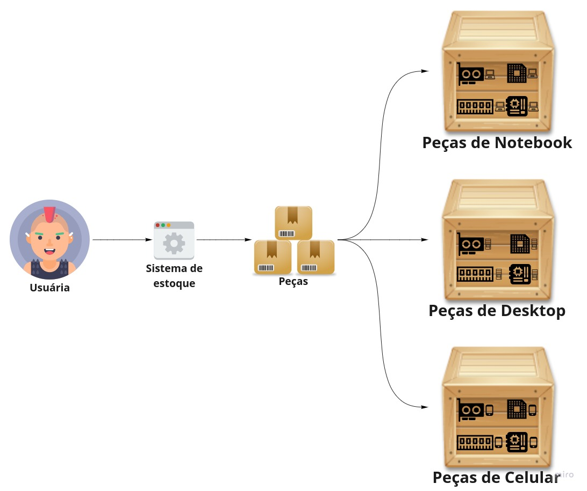

## Factory Method Pattern
* Nesse projeto foi utilizado a simulação de um case que gerencia o estoque de peças para notebooks, desktops e celulares. O pattern foi aplicado na chamada do [**método**](https://github.com/kaikeventura/factory-method-pattern/blob/main/src/com/kaikeventura/inventory/Application.java#L12) que busca uma determinada peça, para cada tipo de estoque de peças é criado uma instância de uma [**classe**](https://github.com/kaikeventura/factory-method-pattern/blob/7d5023f23b20830829c970e80f60c83e42592705/src/com/kaikeventura/inventory/implementation/DesktopInventory.java#L12-L25) que lida com um único tipo de peças, essa classe implementa uma [*interface*](https://github.com/kaikeventura/factory-method-pattern/blob/7d5023f23b20830829c970e80f60c83e42592705/src/com/kaikeventura/inventory/base/Inventory.java) que possui um método devolve um [**hardware**](https://github.com/kaikeventura/factory-method-pattern/blob/7d5023f23b20830829c970e80f60c83e42592705/src/com/kaikeventura/inventory/base/Hardware.java).
* O hardware que é devolvido acima é uma interface que possui um método que informa qual o tipo de hardware uma determinada peça pode ser, essa interface é implementada por uma [**classe**](https://github.com/kaikeventura/factory-method-pattern/blob/7d5023f23b20830829c970e80f60c83e42592705/src/com/kaikeventura/inventory/domain/DesktopHardware.java) concreta especificando qual peça realmente é.
* A imagem abaixo descreve um fluxograma do processo para pegar um determinado hardware do estoque:
# 
## Referências
* https://refactoring.guru/pt-br/design-patterns/factory-method
* https://github.com/iluwatar/java-design-patterns/tree/master/facotry-method
